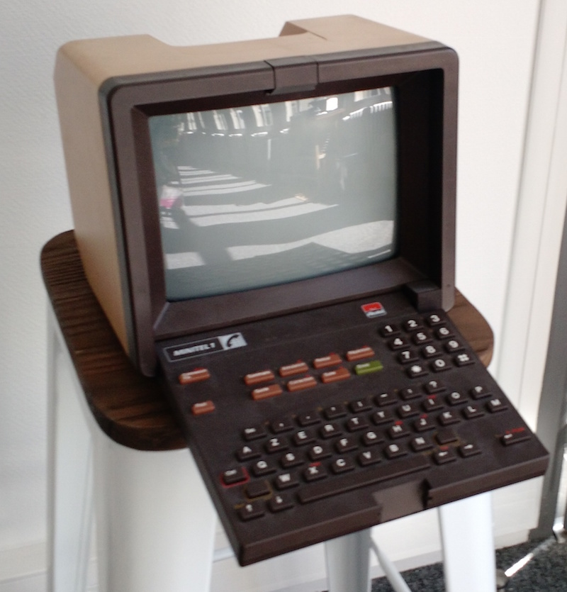

# minitel

resurrection de notre antique minitel

##Actions
- [ ] Ouvrir le minitel, verifier l'état des composants avant allumage,
- [*] Verifier que le minitel est bistandard. Prise DIN + touche Fnct.
- [ ] Alimentation éléctrique, souder le fil,
- [ ] Test allumage,
- [ ] Acheter la liste des composants éléctronique pour l'adaptateur série/minitel,
- [ ] Souder la carte adaptatrice,
- [ ] Raspberry Pi, carte SD, OS
- [ ] Config de la console Serie Linux sur le Minitel

## Links

 - http://wiki.labomedia.org/index.php/Renaissance_d%27un_Minitel_avec_une_Raspberry_Pi
 - http://x0r.fr/blog/5
 - http://caca.zoy.org/wiki/libcaca
 - https://github.com/bevacqua/hit-that
